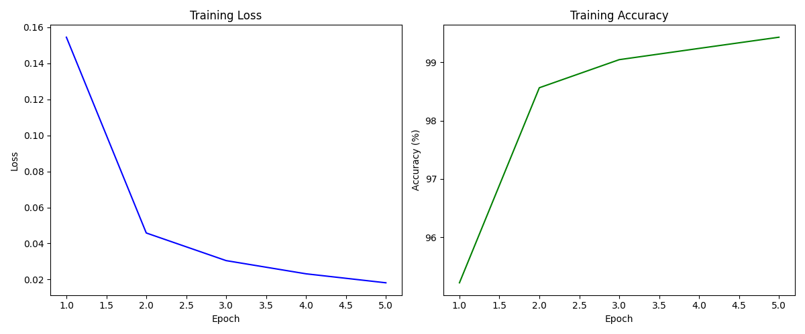

# MNIST 手写数字分类（CNN 模型）

这个项目使用 **PyTorch** 构建了一个卷积神经网络（CNN）模型，用于对 **MNIST** 数据集中的手写数字进行分类。
项目包括了数据预处理、模型定义、训练、测试和训练结果的可视化（如训练损失和准确率曲线）。

## 目录

- [环境要求](#环境要求)
- [文件结构](#文件结构)
- [数据集](#数据集)
- [模型架构](#模型架构)
- [训练](#训练)
- [测试](#测试)
- [可视化](#可视化)
- [使用方法](#使用方法)
- [示例输出](#示例输出)

## 环境要求

硬件：

- CPU：13th Gen Intel(R) Core(TM) i7-13700H   2.40 GHz
- GPU：NVIDIA GeForce RTX 4060 8GB
- RAM：32.0 GB

操作系统：

- Windows 11

语言环境：

- Python 3.9.20

库依赖：

- PyTorch 2.5.1+cu124
- torchvision 0.20.1+cu124
- matplotlib 3.9.3
- tqdm 4.67.1
- torchinfo 1.8.0

## 文件结构

```
├── README.md
├── lab1_torchvision.py
├── data
│   └── MNIST
│       └──raw
│          ├── t10k-images-idx3-ubyte.gz
│          ├── t10k-labels-idx1-ubyte.gz
│          ├── train-images-idx3-ubyte.gz
│          ├── train-labels-idx1-ubyte.gz
│          ├── t10k-images-idx3-ubyte
│          ├── t10k-labels-idx1-ubyte
│          ├── train-images-idx3-ubyte
│          └── train-labels-idx1-ubyte
├── lab1.png
├── lab1.ipynb
└── lab1.py
```

## 数据集

本项目使用 **MNIST** 数据集进行训练和测试。
该数据集包含了60,000张训练图像和10,000张测试图像，类别为0到9的手写数字。

## 模型架构

本项目使用的卷积神经网络（CNN）架构如下：

1. **Conv1**：卷积层，输入1个通道，输出32个通道，卷积核大小3x3，填充1。
2. **Conv2**：卷积层，输入32个通道，输出64个通道，卷积核大小3x3，填充1。
3. **MaxPool2d**：最大池化操作，池化核大小为2x2。
4. **Fully Connected Layer 1**：将卷积层的输出展平后连接到128个神经元。
5. **Fully Connected Layer 2**：输出层，包含10个神经元，表示0到9的数字类别。

每个卷积层和全连接层后都使用了 **ReLU** 激活函数。

## 训练

模型使用 **Adam** 优化器和 **交叉熵损失** 进行训练。在训练过程中，以下指标会被记录：

- 训练损失
- 训练准确率

模型默认训练5个epoch。

## 测试

训练完成后，模型会在测试集上进行评估，并输出测试集的准确率。

## 可视化

训练结束后，模型会绘制训练损失和训练准确率随epoch变化的曲线，帮助你直观地了解模型的训练过程。

## 使用方法

运行程序：

```bash
python lab1.py
```

运行后，程序将：

1. 加载并预处理 MNIST 数据集。
2. 训练 CNN 模型。
3. 在测试集上评估模型。
4. 绘制训练损失和准确率曲线。

## 示例输出

```
==========================================================================================
Layer (type:depth-idx)                   Output Shape              Param #
==========================================================================================
CNNModel                                 [64, 10]                  --
├─Conv2d: 1-1                            [64, 32, 28, 28]          320
├─Conv2d: 1-2                            [64, 64, 14, 14]          18,496
├─Linear: 1-3                            [64, 128]                 401,536
├─Linear: 1-4                            [64, 10]                  1,290
==========================================================================================
Total params: 421,642
Trainable params: 421,642
Non-trainable params: 0
Total mult-adds (M): 273.85
==========================================================================================
Input size (MB): 0.20
Forward/backward pass size (MB): 19.34
Params size (MB): 1.69
Estimated Total Size (MB): 21.23
==========================================================================================
Epoch 1/5: 100%|███████████████████████████████████████████████████████████████████████████████████████████████████████████████████████| 938/938 [00:07<00:00, 121.55batch/s] 
Epoch 1/5, Loss: 0.1544, Accuracy: 95.22%
Epoch 2/5: 100%|███████████████████████████████████████████████████████████████████████████████████████████████████████████████████████| 938/938 [00:09<00:00, 100.28batch/s] 
Epoch 2/5, Loss: 0.0458, Accuracy: 98.56%
Epoch 3/5: 100%|███████████████████████████████████████████████████████████████████████████████████████████████████████████████████████| 938/938 [00:09<00:00, 98.99batch/s] 
Epoch 3/5, Loss: 0.0305, Accuracy: 99.05%
Epoch 4/5: 100%|███████████████████████████████████████████████████████████████████████████████████████████████████████████████████████| 938/938 [00:09<00:00, 101.00batch/s] 
Epoch 4/5, Loss: 0.0232, Accuracy: 99.24%
Epoch 5/5: 100%|███████████████████████████████████████████████████████████████████████████████████████████████████████████████████████| 938/938 [00:09<00:00, 98.23batch/s] 
Epoch 5/5, Loss: 0.0182, Accuracy: 99.43%
Test Accuracy: 98.8%
```


